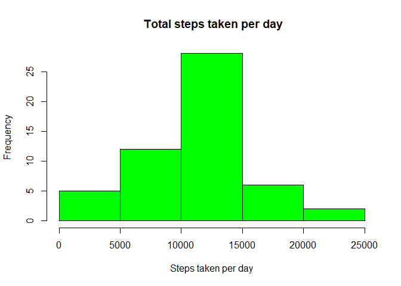
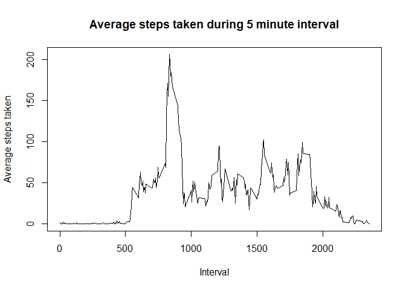
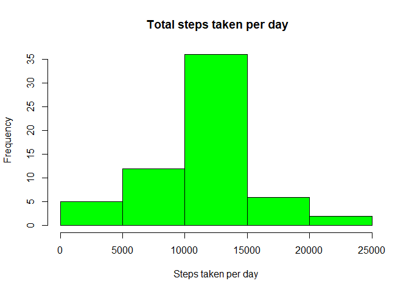
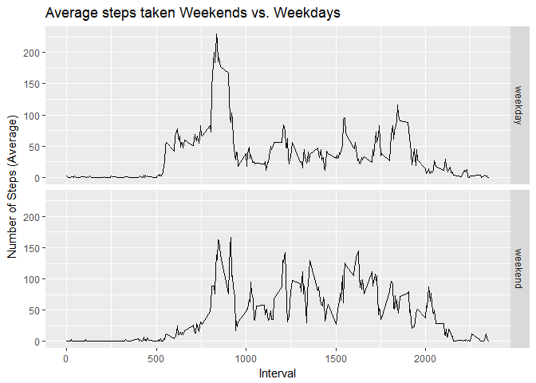

```r
#load library dplyr to aggregate data
library(dplyr)
## 
## Attaching package: 'dplyr'
## The following objects are masked from 'package:stats':
## 
##     filter, lag
## The following objects are masked from 'package:base':
## 
##     intersect, setdiff, setequal, union
```
## Loading and preprocessing the data
###Load the data and then make sure that date converted and stored as a proper date. And also remove the NAs.


```r
#The url of the location of file is pointed to the variable fileUrl and is passed to download file method
fileUrl <- "https://d396qusza40orc.cloudfront.net/repdata%2Fdata%2Factivity.zip"
download.file(fileUrl,dest="activity.zip")

# The zipped file is extracted
unzip("activity.zip")

#Read the csv file
activity_df <- read.csv("activity.csv")

#Remove all NAs
data <- na.omit(activity_df)
#Convert the column date to date format
data$date <- as.Date(data$date)
```

## Histogram of the total number of steps taken each day


```r
#aggregate the data by date and sum the steps
aggdata <- aggregate(data$steps,by = list(data$date), FUN = "sum")

#plot histogram for steps taken per day
hist(aggdata$x,col="green",xlab="Steps taken per day", main = " Total steps taken per day")
```

<!-- -->

```r
#Calculate mean and median of steps
meansteps <- mean(aggdata$x)
mediansteps <- median(aggdata$x)
```

####Mean total number of steps taken each day : 

```r
meansteps
```

```
## [1] 10766.19
```
####Median total number of steps taken each day :

```r
mediansteps
```

```
## [1] 10765
```
##Time series plot of the average number of steps taken


```r
#group the data by interval and calculate mean of steps
fiveaverage <- data %>%
        group_by(interval) %>%
        summarize(AverageSteps=mean(steps))

# Make an average activity plot
plot(fiveaverage$interval, fiveaverage$AverageSteps, 
     type="l",
     xlab="Interval",
     ylab="Average steps taken",
     main="Average steps taken during 5 minute interval")
```

<!-- -->

##The 5-minute interval which has the maximum number of steps

```r
#Aggrgate the data by interval and calculate the mean of steps
interval_mean <- aggregate(data$steps,by = list(data$interval), FUN = "mean")
#Take the max of steps 
max_mean_interval <- interval_mean[ interval_mean$x == max(interval_mean$x), ] 
max_mean_interval$Group.1
## [1] 835
```

###The highest average step count happened during interval 835

## Imputing missing data with mean of interval for that interval of missing data

```r
#Calculating no. of missing values
data_na <- sum(is.na(activity_df$steps))
```
###There are 2304 found missing in the raw data 


```r
#Take in the raw data and fill in with the mean values for that interval 
filled_df <- activity_df
filled_df$date <- as.Date(filled_df$date)

#Find the missing values and fill with the mean interval values corresponding the interval of the missing data
for ( i in 1:nrow(filled_df)){
        if ( is.na(filled_df$steps[i])){
                interval <- filled_df$interval[i]
                val <- interval_mean[interval_mean$Group.1 == interval,]
                # Assign the value to replace the NA
                filled_df$steps[i] <- val$x
                
        }
        
}
```

##Histogram of the total number of steps taken each day after missing values are imputed


```r
# Aggregate with Imputed data by data and sum the steps
aggdata <- aggregate(filled_df$steps,by = list(filled_df$date), FUN = "sum")
#plot the histogram with the imputed data
hist(aggdata$x,col="green",xlab="Steps taken per day", main = " Total steps taken per day")
```

<!-- -->

##Panel plot comparing the average number of steps taken per 5-minute interval across weekdays and weekends

```r
meansteps <- mean(aggdata$x)
mediansteps <- median(aggdata$x)
```

###The mean total number of steps per day is

```r
meansteps
```

```
## [1] 10766.19
```
###The median is 

```r
mediansteps
```

```
## [1] 10766.19
```
####The mean is unchanged, but the median moved slightly and is now equal to the mean. Inputting missing data based on an average leaves the average daily total number of steps the same while changing the median.


##Are there differences in activity patterns between weekdays and weekends?

```r
#Factor the variable as daytype with the weekdays() method
filled_df$weekday <- weekdays(filled_df$date)
filled_df$daytype <- "weekday"

filled_df$daytype[filled_df$weekday %in% c("Saturday", "Sunday")] <- "weekend"

#Aggregate data by daytype and take mean of steps
dayaverage <- filled_df %>%
        group_by(daytype, interval) %>%
        summarize(AverageSteps=mean(steps))
# Load the library for qplot
library(ggplot2)
```

##Panel plot comparing the average number of steps taken per 5-minute interval across weekdays and weekends

```r
qplot(interval, AverageSteps, data=dayaverage,
      type="l",
      geom="line",
      xlab="Interval",
      ylab="Number of Steps (Average)",
      main="Average steps taken Weekends vs. Weekdays",
      facets =daytype ~ .)
```

<!-- -->


##Inference : There are  earlier activity on weekdays as infered from the plot above
